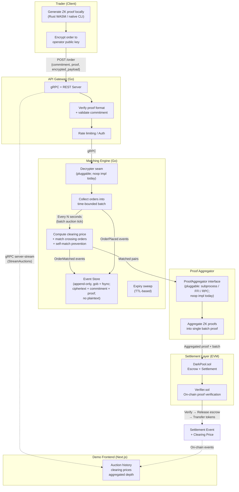

# ZK Dark Pool DEX

A decentralized exchange where orders stay private until settlement. Traders encrypt orders to the operator and prove validity using zero-knowledge proofs, without revealing the pair, price, or size to any external observer.

Go · Rust · Solidity · ZK Circuits (halo2 / arkworks)

https://front-five-flax.vercel.app/

---

## Why this exists

On a normal DEX, your orders sit in a public mempool. Anyone can see them, front-run them, sandwich them. This project takes a different approach: orders are encrypted to the engine operator and matched in periodic batch auctions. The operator proves via ZK that every auction was executed correctly. Settlement happens in batches with aggregated ZK proofs verified on-chain.

Three things we care about:

1. Orders are invisible to external observers before settlement.
2. Every matched trade comes with a ZK proof that the batch auction was computed correctly.
3. Price emerges from the protocol itself — each auction round produces a clearing price with no oracle dependency.

| | Typical DEX | This project |
|---|---|---|
| Order visibility | Public mempool, front-runnable | Private until settlement |
| Proof system | None | ZK-SNARK per order batch |
| Matching model | Continuous on-chain (expensive) | Off-chain periodic batch auction |
| Price discovery | Visible order book | Clearing price after each auction round |
| Settlement | Immediate per-order | Batched, gas-efficient |
| Trust model | Trustless (but transparent) | Semi-trusted operator + ZK proof of correct execution |
| Stack | Solidity only | Go + Rust + Solidity + ZK |

---

## Architecture



---

## Order lifecycle

1. Trader submits a Pedersen commitment to the order parameters and locks collateral in escrow.
2. Trader runs a Rust circuit locally, gets back a ZK proof that the order is valid.
3. Trader encrypts the full order to the operator's public key and submits commitment + proof + encrypted payload.
4. The operator decrypts in memory, collects orders into a time-bounded batch (default: 5s), and runs a batch auction — computing a clearing price and matching all crossing orders. **Plaintext orders exist only in engine RAM during the auction window. The event log is an append-only file (gob-encoded, fsync per append) containing ciphertext + commitment + proof only — never plaintext.**
5. Matched pairs are handed to a pluggable `ProofAggregator` (subprocess / FFI / RPC), then submitted on-chain via a pluggable `Submitter`. The Solidity verifier checks the aggregated proof and transfers tokens atomically.

> **Status note.** The decrypter, proof aggregator, and on-chain submitter are implemented as pluggable seams with noop defaults today. The engine, API, event store, auction, and expiry logic are production-shape; crypto seams need real implementations before mainnet.

---

## Rules

### Matching

- Periodic batch auction (default: every 5 seconds). All orders in the same round are treated equally — no temporal advantage.
- Clearing price computed as the price that maximizes matched volume.
- Partial fills are supported. Residual quantity carries over to the next auction round.
- Orders expire after a configurable TTL (default: 10 min).
- Orders from the same commitment key cannot match each other.
- Minimum order size is enforced at the circuit level, not in the engine.

### Settlement

- Batches hold up to 256 matched pairs. Cap is enforced by the settlement contract; the Go engine hands the aggregator whatever matched in the current auction round.
- If the aggregated proof fails verification, the entire batch is rejected. No partial settlement.
- Collateral is locked in escrow at commitment time and released atomically at settlement (enforced in `DarkPool.sol`).
- 0.05% protocol fee is taken from the taker side (enforced in `DarkPool.sol`).

### Trust model & privacy

- Nobody outside the operator can determine the price or size of a pending order from on-chain data.
- The matching engine operator **can** see decrypted order contents but is cryptographically bound to execute auctions correctly via ZK proofs. This mirrors institutional dark pools in TradFi.
- After settlement, the clearing price and trade amounts become visible but individual orders are unlinkable to wallet addresses without additional info.

---

## Components

| Layer | Language | What it does |
|---|---|---|
| ZK Circuit | Rust (halo2 / arkworks) | Generates and verifies proofs of order validity |
| Matching Engine | Go | Batch auction logic, clearing price computation, event sourcing (`engine/core/`) |
| Event Store | Go | Append-only event log for state reconstruction and auditability |
| Proof Aggregator | Rust (CLI binary) | Combines individual proofs into a single batch proof |
| Settlement Contract | Solidity | On-chain proof verification, token transfers, escrow |
| API Gateway | Go (gRPC + REST) | gRPC handler + REST gateway, order submission and status endpoints |
| Demo Frontend | TypeScript / Next.js | Auction history, clearing prices, aggregated depth |

---

## Project structure

```
server/
├── api/
│   ├── cmd/server/
│   │   └── main.go              # Entrypoint
│   ├── config/
│   │   ├── config.go            # Server configuration
│   │   └── router.go            # Route setup
│   ├── gateway/
│   │   └── gateway.go           # gRPC-Gateway (REST translation)
│   ├── handler/
│   │   └── handler.go           # gRPC server implementation
│   ├── middleware/
│   │   ├── auth.go              # Authentication middleware
│   │   └── ratelimit.go         # Rate limiting
│   ├── utils/
│   │   └── errors.go            # Centralized gRPC error constants
│   ├── gen/                     # Protobuf generated code
│   └── proto/                   # Protobuf definitions
├── engine/
│   ├── core/
│   │   ├── engine.go                 # Engine orchestration, auction tick loop, recovery
│   │   ├── engine_test.go
│   │   ├── orderbook.go              # Order book projection + TTL expiry sweep
│   │   ├── orderbook_test.go
│   │   ├── auction.go                # Batch auction, clearing price, self-match prevention
│   │   ├── auction_test.go
│   │   ├── batch_test.go
│   │   ├── integration_test.go      # End-to-end encrypted-order → settlement flow
│   │   ├── decrypter.go              # Decrypter interface + NoopDecrypter (seam)
│   │   ├── decrypter_ecies.go        # ECIES decrypter (secp256k1 operator key)
│   │   ├── decrypter_ecies_test.go
│   │   ├── submitter.go              # ProofAggregator + Submitter interfaces + noop impls
│   │   ├── submitter_eth.go          # On-chain EthSubmitter (EIP-1559 DynamicFeeTx)
│   │   ├── submitter_eth_test.go
│   │   ├── aggregator_subproc.go     # Subprocess proof aggregator
│   │   ├── aggregator_subproc_test.go
│   │   ├── settlement_watcher.go     # BatchSettled log subscriber w/ reconnect backoff
│   │   ├── settlement_watcher_test.go
│   │   ├── eth_helpers.go            # Shared UUID/decimal/key-loader helpers
│   │   └── abi/
│   │       └── darkpool.go           # DarkPool submitBatch + BatchSettled ABI
│   ├── event/
│   │   ├── event.go             # Event struct, payloads, Store interface
│   │   ├── store.go             # In-memory append-only event log
│   │   ├── store_test.go
│   │   ├── file_store.go        # File-backed event log (gob + fsync per append)
│   │   └── file_store_test.go
│   ├── model/
│   │   └── model.go             # Domain types: Order, Fill
│   └── utils/
│       ├── constants.go         # Shared enums: Side, EventType
│       └── errors.go            # Engine error definitions
├── go.mod
└── go.sum
front/                           # Next.js demo UI
```

---

## Who this is for

Hedge funds, market makers, and DeFi protocols that need MEV protection and don't want their order flow visible to the world.
