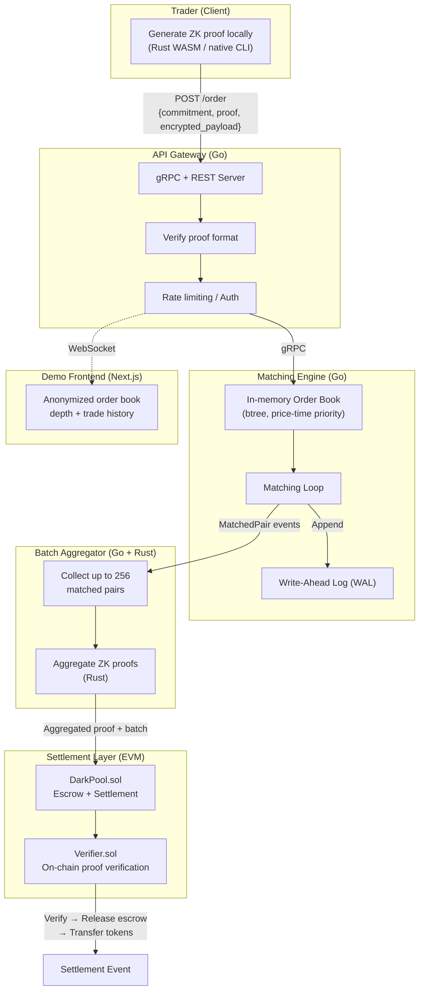

# ZK Dark Pool DEX

> Privacy-preserving decentralized exchange where all orders are completely hidden until settlement.

**Stack:** Go · Rust · Solidity · ZK Circuits (halo2 / arkworks)

---

## Overview

ZK Dark Pool DEX is a DEX where traders submit cryptographic proofs that their orders are valid — sufficient collateral, correct format, within position limits — without revealing the pair, price, or size to any counterparty or on-chain observer.

### Design Goals

- **Pre-trade privacy** — no order data is visible on-chain before matching.
- **Post-trade verifiability** — every matched trade is accompanied by a ZK proof of correct settlement.
- **High-throughput matching** — off-chain Go matching engine, up to 100k orders/sec with p99 latency < 1ms.

### How It Compares

| Dimension | Typical DEX | ZK Dark Pool DEX |
|---|---|---|
| Order visibility | Public mempool, front-runnable | Private until settlement |
| Proof system | None | ZK-SNARK per order batch |
| Matching engine | On-chain (expensive) | Off-chain Go engine, O(log n) |
| Settlement | Immediate per-order | Batched, gas-efficient |
| Stack complexity | Solidity only | Go + Rust + Solidity + ZK |

---

## Architecture



---

## Order Lifecycle

1. **Commitment** — trader submits a Pedersen commitment to the order parameters.
2. **Proof Generation** — trader runs a Rust circuit locally and produces a ZK proof of validity.
3. **Matching** — the Go engine matches bids and asks using price-time priority, operating only on commitments.
4. **Settlement** — a batch of matched pairs is submitted on-chain with aggregated proofs; the Solidity verifier checks each proof and transfers tokens atomically.

---

## Business Rules

### Matching

- Price-time priority (FIFO within the same price level).
- Partial fills supported; residual quantity remains in the book.
- Orders expire after a configurable TTL (default: 10 min).
- Self-match prevention: orders from the same commitment key cannot match.
- Minimum order size enforced at the circuit level.

### Settlement

- Batches of up to 256 matched pairs.
- Aggregated proof verified on-chain — if it fails, the entire batch is rejected.
- Collateral locked in escrow at commitment time, released atomically at settlement.
- 0.05% protocol fee deducted from the taker side.

### Privacy Guarantees

- External observers cannot determine price or size of pending orders from on-chain data.
- The matching engine operator only sees commitments and proof validity bits.
- Post-settlement, trade amounts are revealed but unlinkable to wallet addresses.

---

## Components

| Layer | Language | Responsibility |
|---|---|---|
| ZK Circuit | Rust (halo2 / arkworks) | Generate & verify proofs of order validity |
| Matching Engine | Go | In-memory order book, price-time matching, WAL |
| Settlement Contract | Solidity | On-chain proof verification, token transfer, escrow |
| API Gateway | Go (gRPC + REST) | Client-facing order submission and status endpoints |
| Demo Frontend | TypeScript / Next.js | Anonymized order book depth and trade history |

---

## Project Structure

```
darkpool/
├── engine/
│   ├── orderbook.go         # Core order book: btree + price-time priority
│   ├── matcher.go           # Matching loop, partial fills
│   ├── wal.go               # Write-ahead log for crash recovery
│   ├── orderbook_test.go    # Unit tests
│   └── bench_test.go        # Benchmarks (target: 100k orders/s)
├── zkproof/
│   ├── circuits/            # Rust: halo2 circuits for order validity
│   ├── prover/              # Proof generation (native + WASM target)
│   └── aggregator/          # Batch proof aggregation
├── contracts/
│   ├── DarkPool.sol         # Main escrow + settlement contract
│   ├── Verifier.sol         # Auto-generated from circuit
│   └── test/                # Foundry tests
├── api/
│   ├── server.go            # gRPC server + REST gateway
│   ├── proto/               # Protobuf definitions
│   └── middleware/          # Rate limiting, auth
├── frontend/
│   └── ...                  # Next.js demo UI
├── docs/
│   ├── whitepaper.md        # Technical design document
│   └── benchmarks.md        # Public performance results
└── docker-compose.yml       # Local dev stack
```

---

## Target Audience

Protocols and institutions that need MEV protection and order confidentiality — hedge funds, market makers, and DeFi protocols building on top of privacy layers.
