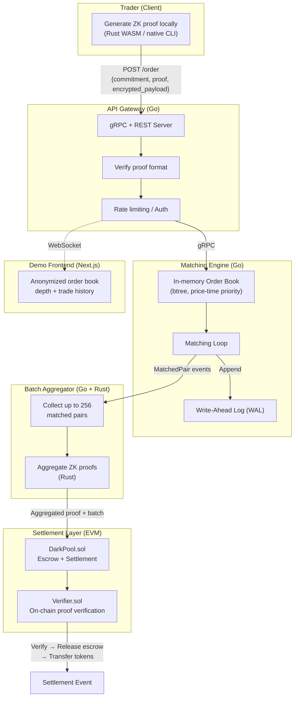

# ZK Dark Pool DEX

A decentralized exchange where orders stay private until settlement. Traders prove their orders are valid (enough collateral, correct format, within limits) using zero-knowledge proofs, without revealing the pair, price, or size to anyone.

Go · Rust · Solidity · ZK Circuits (halo2 / arkworks)

https://front-five-flax.vercel.app/

---

## Why this exists

On a normal DEX, your orders sit in a public mempool. Anyone can see them, front-run them, sandwich them. This project takes a different approach: orders are cryptographic commitments. The matching engine never sees the actual order contents, only commitments and proof validity bits. Settlement happens in batches with aggregated ZK proofs verified on-chain.

Three things we care about:

1. Orders are invisible on-chain before matching.
2. Every matched trade comes with a ZK proof that settlement was computed correctly.
3. The off-chain Go matching engine handles up to 100k orders/sec with p99 latency under 1ms.

| | Typical DEX | This project |
|---|---|---|
| Order visibility | Public mempool, front-runnable | Private until settlement |
| Proof system | None | ZK-SNARK per order batch |
| Matching engine | On-chain (expensive) | Off-chain Go engine, O(log n) |
| Settlement | Immediate per-order | Batched, gas-efficient |
| Stack | Solidity only | Go + Rust + Solidity + ZK |

---

## Architecture



---

## Order lifecycle

1. Trader submits a Pedersen commitment to the order parameters.
2. Trader runs a Rust circuit locally, gets back a ZK proof that the order is valid.
3. The Go engine matches bids and asks by price-time priority. It only ever sees commitments, never actual order data.
4. Matched pairs get batched and sent on-chain with aggregated proofs. The Solidity verifier checks the proofs and transfers tokens atomically.

---

## Rules

### Matching

- Price-time priority (FIFO within the same price level).
- Partial fills are supported. Residual quantity stays in the book.
- Orders expire after a configurable TTL (default: 10 min).
- Orders from the same commitment key cannot match each other.
- Minimum order size is enforced at the circuit level, not in the engine.

### Settlement

- Batches hold up to 256 matched pairs.
- If the aggregated proof fails verification, the entire batch is rejected. No partial settlement.
- Collateral is locked in escrow at commitment time and released atomically at settlement.
- 0.05% protocol fee is taken from the taker side.

### What's private, what's not

- Nobody can determine the price or size of a pending order from on-chain data.
- The matching engine operator only sees commitments and proof validity bits. Not order contents.
- After settlement, trade amounts become visible but are unlinkable to wallet addresses without additional info.

---

## Components

| Layer | Language | What it does |
|---|---|---|
| ZK Circuit | Rust (halo2 / arkworks) | Generates and verifies proofs of order validity |
| Matching Engine | Go | In-memory order book, price-time matching, WAL |
| Settlement Contract | Solidity | On-chain proof verification, token transfers, escrow |
| API Gateway | Go (gRPC + REST) | Order submission and status endpoints |
| Demo Frontend | TypeScript / Next.js | Shows anonymized order book depth and trade history |

---

## Project structure

```
darkpool/
├── engine/
│   ├── orderbook.go         # Core order book: btree + price-time priority
│   ├── matcher.go           # Matching loop, partial fills
│   ├── wal.go               # Write-ahead log for crash recovery
│   ├── orderbook_test.go    # Unit tests
│   └── bench_test.go        # Benchmarks (target: 100k orders/s)
├── zkproof/
│   ├── circuits/            # Rust: halo2 circuits for order validity
│   ├── prover/              # Proof generation (native + WASM target)
│   └── aggregator/          # Batch proof aggregation
├── contracts/
│   ├── DarkPool.sol         # Main escrow + settlement contract
│   ├── Verifier.sol         # Auto-generated from circuit
│   └── test/                # Foundry tests
├── api/
│   ├── server.go            # gRPC server + REST gateway
│   ├── proto/               # Protobuf definitions
│   └── middleware/          # Rate limiting, auth
├── frontend/
│   └── ...                  # Next.js demo UI
├── docs/
│   ├── whitepaper.md        # Technical design document
│   └── benchmarks.md        # Public performance results
└── docker-compose.yml       # Local dev stack
```

---

## Who this is for

Hedge funds, market makers, and DeFi protocols that need MEV protection and don't want their order flow visible to the world.
