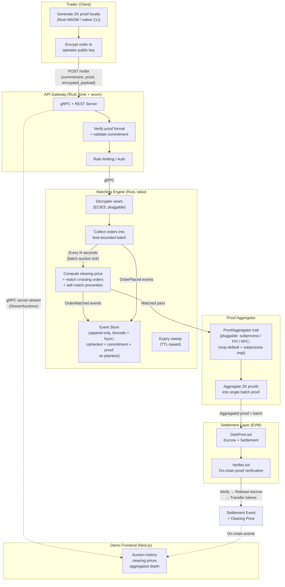

# ZK Dark Pool DEX

A decentralized exchange where orders stay private until settlement. Traders encrypt orders to the operator and prove validity using zero-knowledge proofs, without revealing the pair, price, or size to any external observer.

Rust · Solidity · ZK Circuits (arkworks)

https://front-five-flax.vercel.app/

---

## Why this exists

On a normal DEX, your orders sit in a public mempool. Anyone can see them, front-run them, sandwich them. This project takes a different approach: orders are encrypted to the engine operator and matched in periodic batch auctions. The operator proves via ZK that every auction was executed correctly. Settlement happens in batches with aggregated ZK proofs verified on-chain.

Three things we care about:

1. Orders are invisible to external observers before settlement.
2. Every matched trade comes with a ZK proof that the batch auction was computed correctly.
3. Price emerges from the protocol itself — each auction round produces a clearing price with no oracle dependency.

| | Typical DEX | This project |
|---|---|---|
| Order visibility | Public mempool, front-runnable | Private until settlement |
| Proof system | None | ZK-SNARK per order batch |
| Matching model | Continuous on-chain (expensive) | Off-chain periodic batch auction |
| Price discovery | Visible order book | Clearing price after each auction round |
| Settlement | Immediate per-order | Batched, gas-efficient |
| Trust model | Trustless (but transparent) | Semi-trusted operator + ZK proof of correct execution |
| Stack | Solidity only | Rust + Solidity + ZK |

---

## Architecture


```mermaid
flowchart TB
    subgraph Client["Trader (Client)"]
        A1["Generate ZK proof locally\n(Rust WASM / native CLI)"]
        A2["Encrypt order to\noperator public key"]
    end

    subgraph API["API Gateway (Rust, tonic + axum)"]
        B["gRPC + REST Server"]
        B1["Verify proof format\n+ validate commitment"]
        B2["Rate limiting / Auth"]
    end

    subgraph Engine["Matching Engine (Rust, tokio)"]
        C["Decrypter seam\n(ECIES; pluggable)"]
        D["Collect orders into\ntime-bounded batch"]
        D2["Compute clearing price\n+ match crossing orders\n+ self-match prevention"]
        ES["Event Store\n(append-only, bincode + fsync;\nciphertext + commitment + proof;\nno plaintext)"]
        EX["Expiry sweep\n(TTL-based)"]
    end

    subgraph Aggregator["Proof Aggregator"]
        F["ProofAggregator trait\n(pluggable: subprocess / FFI / RPC;\nnoop default + subprocess impl)"]
        G["Aggregate ZK proofs\ninto single batch proof"]
    end

    subgraph Contracts["Settlement Layer (EVM)"]
        H["DarkPool.sol\nEscrow + Settlement"]
        I["Verifier.sol\nOn-chain proof verification"]
    end

    subgraph Frontend["Demo Frontend (Next.js)"]
        J["Auction history\nclearing prices\naggregated depth"]
    end

    A1 --> A2
    A2 -- "POST /order\n{commitment, proof, encrypted_payload}" --> B
    B --> B1 --> B2
    B2 -- "gRPC" --> C
    C --> D
    D -- "Every N seconds\n(batch auction tick)" --> D2
    D2 -- "OrderMatched events" --> ES
    D -- "OrderPlaced events" --> ES
    D2 -- "Matched pairs" --> F
    F --> G
    G -- "Aggregated proof + batch" --> H
    H --> I
    I -- "Verify → Release escrow\n→ Transfer tokens" --> K["Settlement Event\n+ Clearing Price"]

    B -. "gRPC server-stream\n(StreamAuctions)" .-> J
    K -. "On-chain events" .-> J
```

---

## Order lifecycle

1. Trader submits a Poseidon commitment to the order parameters and locks collateral in escrow.
2. Trader runs a Rust circuit locally, gets back a ZK proof that the order is valid.
3. Trader encrypts the full order to the operator's public key and submits commitment + proof + encrypted payload.
4. The operator decrypts in memory, collects orders into a time-bounded batch (default: 5s), and runs a batch auction — computing a clearing price and matching all crossing orders. **Plaintext orders exist only in engine RAM during the auction window. The event log is an append-only file (bincode-encoded, fsync per append) containing ciphertext + commitment + proof only — never plaintext.**
5. Matched pairs are handed to a pluggable `ProofAggregator` (subprocess / FFI / RPC), then submitted on-chain via a pluggable `Submitter`. The Solidity verifier checks the aggregated proof and transfers tokens atomically.

> **Status note.** ECIES decryption and the subprocess proof aggregator are implemented. The `alloy`-based `EthSubmitter` in `dp-settlement` is wired into `darkpool-server`: setting `--eth-rpc` together with `--signer-key-uri` (and `--contract-addr`) builds a live on-chain submitter, while `--eth-rpc` without a signer logs a warning and falls back to the noop submitter. All seams are pluggable. The engine, API, event store, auction, and expiry logic are production-shape; the Groth16 settlement path is live, but the HyperNova decider verifier is still a stub and its trusted setup is pending before mainnet.

---

## Rules

### Matching

- Periodic batch auction (default: every 5 seconds). All orders in the same round are treated equally — no temporal advantage.
- Clearing price computed as the price that maximizes matched volume.
- Partial fills are supported. Residual quantity carries over to the next auction round.
- Orders expire after a configurable TTL (default: 10 min).
- Orders from the same trader cannot match each other.
- Minimum order size is enforced at the circuit level, not in the engine.

### Settlement

- Batches hold up to 256 matched pairs. Cap is enforced by the settlement contract; the engine hands the aggregator whatever matched in the current auction round.
- If the aggregated proof fails verification, the entire batch is rejected. No partial settlement.
- Collateral is locked in escrow at commitment time and released atomically at settlement (enforced in `DarkPool.sol`).
- 0.05% protocol fee is deducted from the sell (ask) side (enforced in `DarkPool.sol`).

### Trust model & privacy

- Nobody outside the operator can determine the price or size of a pending order from on-chain data.
- The matching engine operator **can** see decrypted order contents but is cryptographically bound to execute auctions correctly via ZK proofs. This mirrors institutional dark pools in TradFi.
- After settlement, the clearing price and trade amounts become visible but individual orders are unlinkable to wallet addresses without additional info.

---

## Components

| Layer | Language | What it does |
|---|---|---|
| ZK Circuit | Rust (arkworks) | Generates and verifies proofs of order validity |
| Matching Engine | Rust (tokio) | Batch auction logic, clearing price computation, event sourcing (`crates/dp-engine/`) |
| Event Store | Rust (bincode + fsync) | Append-only event log for state reconstruction and auditability (`crates/dp-event/`) |
| Proof Aggregator | Rust (subprocess) | Combines individual proofs into a single batch proof (`crates/dp-aggregator/`) |
| Settlement Contract | Solidity | On-chain proof verification, token transfers, escrow |
| API Gateway | Rust (tonic gRPC + axum REST) | Order submission and status endpoints, auth, rate-limit (`crates/dp-api/`) |
| Demo Frontend | TypeScript / Next.js | Auction history, clearing prices, aggregated depth |

---

## Local development (Docker Compose)

Prerequisites: Docker (with Compose v2.20+), [Foundry](https://getfoundry.sh), [just](https://github.com/casey/just).

```bash
cp .env.example .env

# 1. Start infra (postgres + anvil + dp-api)
just up

# 2. Deploy contracts to the local anvil chain
just deploy

# 3. Fund a test trader with mock WETH + USDC
just fund-trader

# 4. (Optional) Start the frontend on :3000
just up-frontend
```

Other useful recipes:

```bash
just logs                  # tail darkpool-server logs
just logs anvil            # tail anvil logs
just up-obs                # add Prometheus + Grafana + Jaeger
just up-zk                 # add ZK keygen + aggregator
just ps                    # show running services
just down                  # stop everything
just clean                 # stop + remove volumes (destructive)
```

See `.env.example` for all configurable variables.

---

## Build & run (without Docker)

```bash
cargo build --release --workspace
cargo test  --workspace
cargo run   --release --bin darkpool-server
```

`darkpool-server` is the operator binary. Common flags (see `crates/dp-api/src/config.rs` for the full list):

```
--grpc-addr 0.0.0.0:9090         # gRPC listen addr
--http-addr 0.0.0.0:8080         # REST listen addr
--auction-interval 5s            # batch auction tick
--event-log /var/lib/darkpool.log  # durable event log (omit → in-memory)
--operator-key /etc/darkpool/op.key  # ECIES private key (single-key mode)
--operator-key-uris file:/etc/dp/active.hex@active,age:/etc/dp/old.age@sunset
                                 # multi-key rotation mode (issue #28)
--snapshot-key-uri file:/etc/dp/snapshot.hex
                                 # dedicated key encrypting state snapshots at rest (issue #203);
                                 # required when --snapshot-dir or a postgres store is used
--signer-key-uri file:/etc/dp/eth.hex   # independent Ethereum signer URI
--aggregator-bin /usr/local/bin/dp-aggregate  # proof aggregator subprocess (omit → noop)
--eth-rpc https://...            # settlement RPC (with --signer-key-uri + --contract-addr → on-chain)
--api-keys k1,k2                 # comma-separated API keys (omit → no auth)
--rate-limit 100  --rate-burst 20  --rate-stale-after 5m
```

### Operations

- [Operator key rotation](docs/operations/key-rotation.md) — runbook for
  generating, publishing, registering, draining, and deleting an
  ECIES key without restarting the operator.
- [Snapshot encryption at rest](docs/adr/0006-snapshot-encryption-at-rest.md)
  — why state snapshots are AEAD-sealed under a dedicated key, and how to
  provision `--snapshot-key-uri`.

## Project structure

```
crates/
├── dp-types/        # Shared domain types (Order, Fill, Side, EventType)
├── dp-crypto/       # ECIES decrypter + commitment computation
├── dp-event/        # Append-only event store (MemStore + FileStore + PgStore, bincode + fsync)
├── dp-book/         # Order book projection + depth aggregation
├── dp-auction/      # Batch auction, clearing price, self-match prevention
├── dp-aggregator/   # Pluggable proof aggregator (noop + subprocess)
├── dp-settlement/   # EthSubmitter (alloy) + BatchSettled watcher
├── dp-engine/       # Orchestrator: tick loop, recovery, batch lifecycle
└── dp-api/          # tonic gRPC + axum REST, validation, auth, rate-limit
                     #   includes the `darkpool-server` binary entrypoint
front/               # Next.js demo UI
Cargo.toml
```

---

## Who this is for

Hedge funds, market makers, and DeFi protocols that need MEV protection and don't want their order flow visible to the world.
